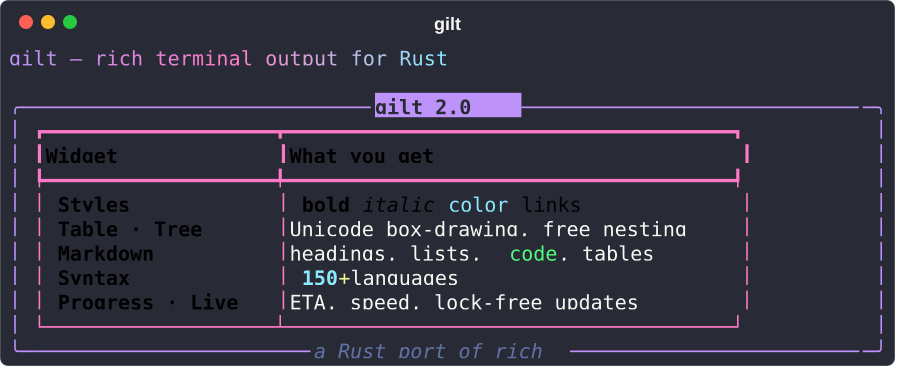
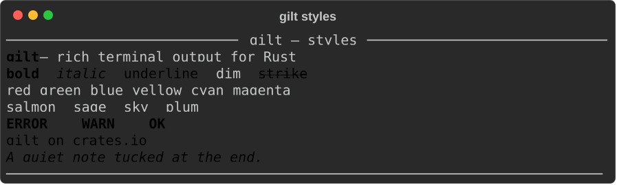
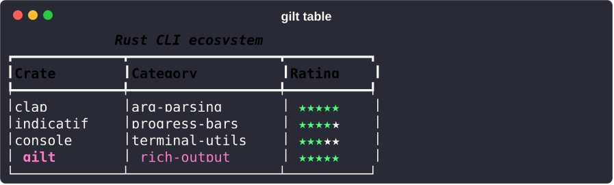
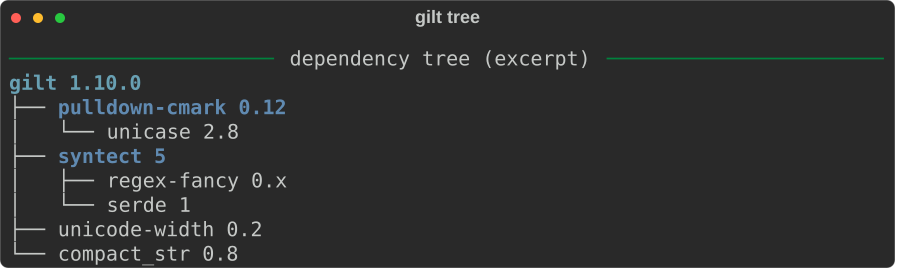
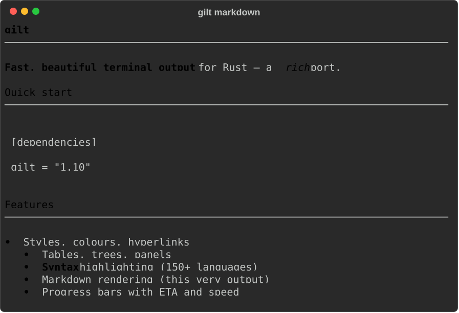
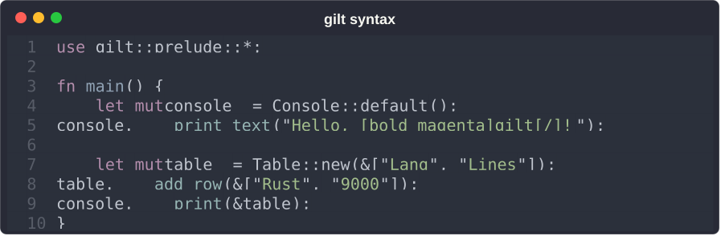
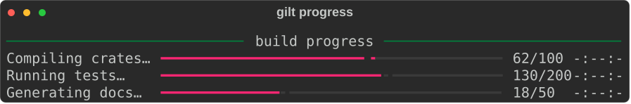
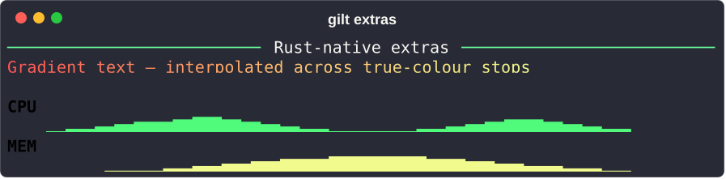

# gilt

**Rich terminal output for Rust** — a port of Python's [rich](https://github.com/Textualize/rich), plus Rust-native extras: a compile-time `text!` macro, a WASM-safe build, lock-free async `Live`, inline images, asciinema export, and 7 widget derives.

[](https://github.com/khalidelborai/gilt/actions)
[](https://crates.io/crates/gilt)
[](https://docs.rs/gilt)
[](LICENSE)
[](https://blog.rust-lang.org/2024/10/17/Rust-1.82.0.html)



## What gilt is — and is not

gilt emits **scrolling, styled ANSI output** (styles, tables, trees, syntax,
markdown, progress bars, live displays) that drops straight into any CLI. You
`print` renderables and they scroll by just like normal terminal output.

gilt is **not** a full-screen TUI framework — it does not own the alternate
screen, run an event loop, or need `crossterm` for basic output. Reach for
[ratatui](https://crates.io/crates/ratatui) when you need a full-screen
interactive app; reach for gilt for CLI output, log styling, CI reports, build
dashboards, and streaming output.

## Quick start

```toml
[dependencies]
gilt = "2.0"
```

```rust
use gilt::console::Console;

fn main() {
    let mut console = Console::default();
    console.print_text("Hello, [bold magenta]gilt[/bold magenta]!");
}
```

Upgrading? See [MIGRATION_v2.md](MIGRATION_v2.md) for the 1.x → 2.0 changes
(and [MIGRATION_v1.md](MIGRATION_v1.md) for 0.13 → 1.0).

## Visual gallery

Every image below is produced by gilt's **own** SVG export
(`cargo run --example gen_readme_demos --all-features`) and committed, so it
renders on GitHub and docs.rs without a server.

**Styles** — markup, named + true colour, backgrounds, hyperlinks:



**Table** — Unicode box-drawing with styled headers and inline markup:



**Tree** — hierarchies with configurable guide characters:



**Markdown** — headings, lists, inline + fenced code:



**Syntax** — 150+ languages with line numbers:



**Progress** — multi-bar with description, bar, percent, and ETA:



**Rust-native extras** — gradient text and sparklines:



## gilt-cli — rich output without Rust

Install the binary to use gilt from shell scripts, Makefiles, and CI:

```sh
cargo install gilt-cli
```

```sh
gilt print '[bold]hello[/] from gilt'
gilt table < data.csv
echo '# Title' | gilt markdown
cat src/main.rs | gilt syntax --lang rust
gilt rule 'Deploy complete'
```

Full subcommand reference: [`crates/gilt-cli/`](crates/gilt-cli/README.md).

## Features

- **Core widgets** — `Text` · `Table` · `Panel` · `Tree` · `Columns` ·
  `Layout` · `Padding` · `Align` · `Group`. In **2.0** every container holds
  any `Renderable`, so they nest freely (a `Panel` of a `Table`, a `Tree`
  label that is a `Panel`, a table cell holding a `Panel`).
- **Terminal features** — `Syntax` (150+ languages) · `Markdown` · `Json` ·
  `Progress` (ETA, speed, spinner) · `Live` (lock-free in-place updates) ·
  `Status`.
- **Rust-native extras** — `Gradient` · `Sparkline` · `Canvas` (Braille) ·
  `Diff` (unified + side-by-side) · `Figlet` · `CsvTable` · `Stylize`
  (`"hi".bold().red()`) · iterator `.progress()` · `Inspect` (any `Debug`) ·
  environment detection · WCAG 2.1 contrast · extended underlines · bidirectional
  `anstyle` interop.
- **Derive macros** (feature `derive`) — `Table`, `Panel`, `Tree`, `Columns`,
  `Rule`, `Inspect`, `Renderable`, plus the compile-time `text!` macro that
  validates markup at compile time. See [`crates/gilt-derive/`](crates/gilt-derive/README.md).
- **Optional integrations** — `miette` · `eyre` · `tracing` · `anstyle`.

## Why gilt?

| | gilt | rich (Python) | ratatui | Spectre.Console |
|---|---|---|---|---|
| Language | Rust | Python | Rust | C# |
| Inline scrolling output | **yes** | **yes** | no | **yes** |
| Full-screen TUI | no | no | **yes** | no |
| Compile-time `text!` macro | **yes** | no | no | no |
| WASM-safe | **yes** | no | no | no |
| Derive macros | **yes** | no | no | partial |
| Inline images / asciinema export | **yes** | partial | no | no |

gilt is the natural choice for *rich*-style inline output in a Rust CLI or
library — especially when WASM portability, dependency minimisation, or
compile-time macros matter.

## Documentation

| Resource | Where |
|----------|-------|
| API docs | [docs.rs/gilt](https://docs.rs/gilt) |
| Release notes | [CHANGELOG.md](CHANGELOG.md) |
| Migration guides | [v2](MIGRATION_v2.md) · [v1](MIGRATION_v1.md) |
| Live & streaming | [docs/live-and-streaming.md](docs/live-and-streaming.md) |
| Derive macros | [crates/gilt-derive/](crates/gilt-derive/README.md) |
| Examples | [`examples/`](examples/) — `cargo run --example <name>` |
| Feature flags | [docs.rs/crate/gilt/latest/features](https://docs.rs/crate/gilt/latest/features) |

## WebAssembly · Unicode · performance

- **WebAssembly** — compiles for `wasm32-unknown-unknown` with
  `default-features = false` (no `libc`, `crossterm`, or terminal syscalls).
  The intended path is record-mode + export with an explicit width:
  ```toml
  gilt = { version = "2.0", default-features = false, features = ["json", "markdown", "syntax"] }
  ```
  See [`examples/wasm_export.rs`](examples/wasm_export.rs).
- **Unicode** — visible width via [`unicode-width`](https://docs.rs/unicode-width)
  and grapheme iteration (UAX #29) via [`unicode-segmentation`](https://docs.rs/unicode-segmentation).
  CJK fullwidth, single-codepoint / ZWJ / flag emoji, variation selectors, and
  combining marks are width-correct and never split mid-cluster; truncation snaps
  to cluster boundaries. Out of scope: bidi/RTL, NFC/NFD normalisation, vertical
  layout.
- **Performance** — `cargo bench` runs ~80 criterion benchmarks. See
  [CHANGELOG.md](CHANGELOG.md) for the v0.11 perf pass (lock-free `Live`,
  −46% table render, …).

## MSRV & license

**MSRV 1.82.0** (for `std::sync::LazyLock`). Licensed **MIT** — see [LICENSE](LICENSE).
